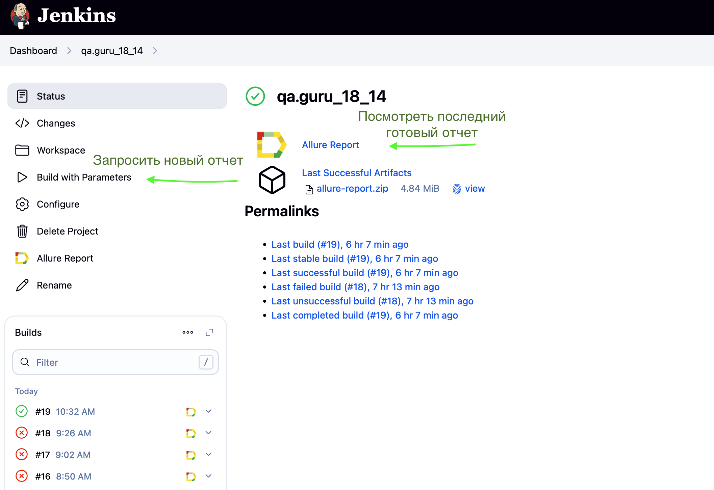
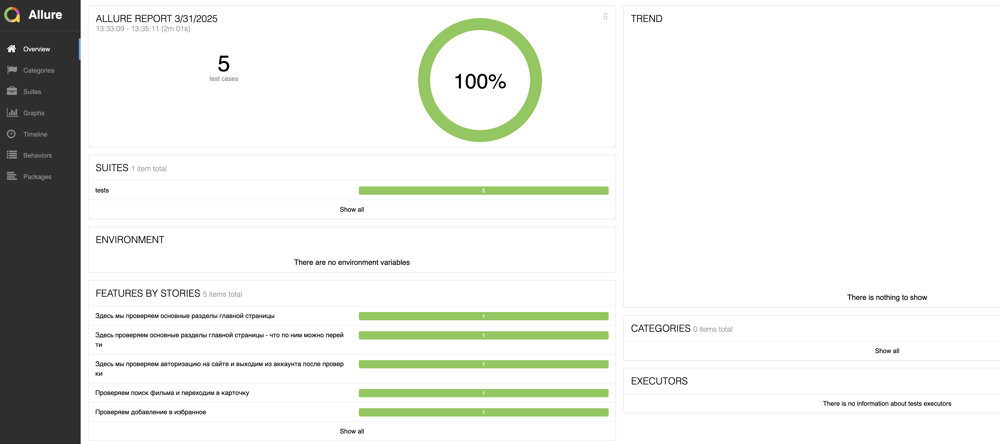
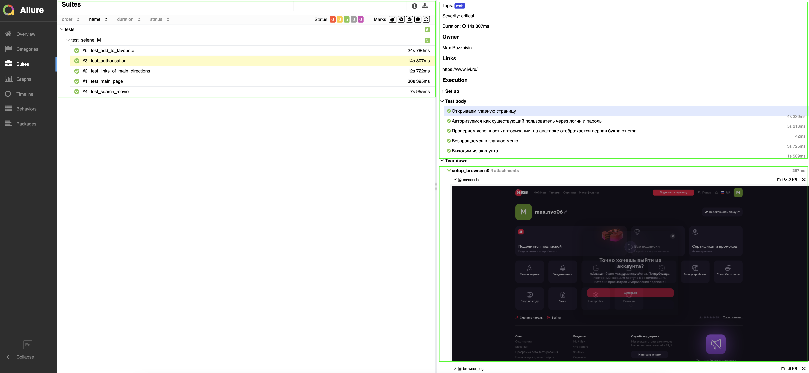
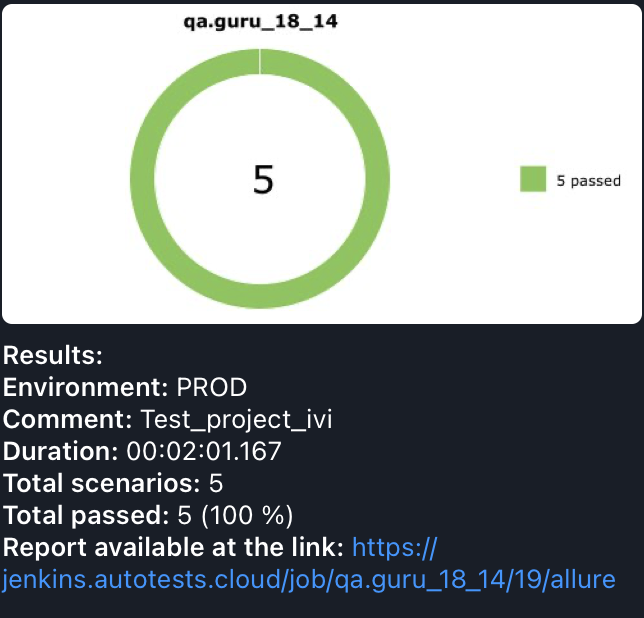

# Ivi.tv

## Description:
В этом репозитории:
- Демо-проект с <b>автотестами</b> на <b>Python</b>.
- Настроен запуск тестов "одной кнопкой" с любого компьютера со стабильным интернетом. Установка ПО не требуется.
- Визуальный отчет о прохождении тестов. Отчет может сформировать любой сотрудник: оценить тестовое покрытие и/или передать разработчикам информацию о проблеме.
- После выполнения каждого теста записывается видео и скриншот экрана.
- Уведомление о результатах тестов в <b>Telegram</b> группу.

## Stack:
<code></code>
<code></code>
<code></code>
<code></code>
<code></code>
<code></code>
<code></code>
<code></code>
 
- Язык: `Python`
- Для написания UI-тестов используется фреймворк `Selene`, современная «обёртка» вокруг `Selenium WebDriver`
- Библиотека модульного тестирования: `PyTest`
- `Jenkins` выполняет удаленный запуск тестов в графическом интерфейсе. Установки дополнительных приложений на компьютер пользователя не требуется.
- `Selenoid` запускает браузер с тестами в контейнерах `Docker` (и записывает видео)
- Фреймворк`Allure Report` собирает графический отчет о прохождении тестов
- После завершения тестов `Telegram Bot` отправляет в `Telegram` краткий вариант Allure Report

## Tests:
- [x] Отображается главная страница и основные разделы сайта (мой иви, фильмы, сериалы, мультфильмы)
- [x] Основные разделы кликабельны и по ним можно перейти
- [x] Проверка авторазации на сайте
- [x] Поиск фильма на сайте и переход в его карточку
- [x] Добавление фильма в избранное (список - "буду смотреть") и проверка в личном кабинете

### Удаленный запуск тестов (<b>Jenkins <a target="_blank" href="https://jenkins.autotests.cloud/job/qa.guru_18_14/">Job</a></b>)

   
Краткая инструкция

###### А: 

<i>Незарегистрированным</i> пользователем открыть готовый, ранее сформированный отчет (желтая иконка, стрелка №2 на скриншоте)

Результат: откроется страница с отчетом Allure Report

###### Б: 
<i>Зарегистрированным</i> пользователем: 
1. Перейти на страницу сборки проекта
2. Выбрать желаемые "Build with Parameters" в графическом интерфейсе или оставить как есть.
3. Запустить выполнение тестов кнопкой "Build"
4. Убедиться, что в блоке "Builds" появилась новая запись.
5. Дождаться окончания активного процесса (~2-3 мин)
6. Кликнуть по значку или тексту Allure Report

Результат: откроется страница с отчетом Allure Report

> 
Срок хранения сборки на сервере ~60 дней. Ссылка на Job может оказаться недоступной после 28.05.2025

Образец:

 

## Allure: пример отчета

   
Скриншоты

###### Главный экран (Owerwiev)

###### Страница со списком тестов (Graph)

###### Пример описания теста

## Видео тестов
Видеозапись каждого теста генерируется с помощью `Selenoid`, после успешного запуска контейнера c тестами в `Docker`. 

Видеозапись

Образец:

## Отчет в Telegram
После завершения сборки специальный Telegram-бот отправляет сообщение с отчетом.
Чтобы видеть его увидеть, вступите (временно) в группу `MaxNovo reports allure`

