# Ivi.tv


## Description:
В этом репозитории:
- Демо-проект с <b>автотестами</b> на <b>Python</b>.
- Настроен запуск тестов "одной кнопкой" с любого компьютера со стабильным интернетом. Установка ПО не требуется.
- Визуальный отчет о прохождении тестов. Отчет может сформировать любой сотрудник: оценить тестовое покрытие и/или передать разработчикам информацию о проблеме.
- После выполнения каждого теста записывается видео и скриншот экрана.
- Уведомление о результатах тестов в <b>Telegram</b> группу.
- Запуск мобильных автотестов на Андроид через Appium (локальный запуск через установленное приложение на девайсе из play market)

## Stack:
<code></code>
<code></code>
<code></code>
<code></code>
<code></code>
<code></code>
<code></code>
<code></code>
<code></code>
<code></code>
<br>
- Язык: `Python`
- Для написания UI-тестов используется фреймворк `Selene`, современная «обёртка» вокруг `Selenium WebDriver`
- Библиотека модульного тестирования: `PyTest`
- `Jenkins` выполняет удаленный запуск тестов в графическом интерфейсе. Установки дополнительных приложений на компьютер пользователя не требуется.
- `Selenoid` запускает браузер с тестами в контейнерах `Docker` (и записывает видео)
- Фреймворк`Allure Report` собирает графический отчет о прохождении тестов
- После завершения тестов `Telegram Bot` отправляет в `Telegram` краткий вариант Allure Report
- Мобильные тесты выполняются только локально - т.к. нет в общем доступе установочного .apk (иначе можно сделать и через браузерную ферму Browserstack)
- При локальном запуске отчет в телеграм не отправляется, но возможно посмотреть аллюр отчет через команду allure serve {путь до папки allure-reports}

## Tests:
- [x] Отображается главная страница и основные разделы сайта (мой иви, фильмы, сериалы, мультфильмы)
- [x] Основные разделы кликабельны и по ним можно перейти
- [x] Проверка авторазации на сайте
- [x] Поиск фильма на сайте и переход в его карточку
- [x] Добавление фильма в избранное (список - "буду смотреть") и проверка в личном кабинете

## Mobile Tests:
- [x] Отображается главная страница и основные разделы сайта (мой иви, поиск, поток, избранное, войти)
- [x] Проверка функции поиска и результата поиска, переход на карточку фильма
- [x] Проверка авторизации в приложении - введение логина/пароля и проверка результата в личном кабинете

----


### Удаленный запуск тестов (<b>Jenkins <a target="_blank" href="https://jenkins.autotests.cloud/job/qa.guru_18_14/">Job</a></b>)
<details>
   <summary>Краткая инструкция</summary>

###### А: 

<i>Незарегистрированным</i> пользователем открыть готовый, ранее сформированный отчет (желтая иконка, стрелка №2 на скриншоте)
<p>Результат: откроется страница с отчетом Allure Report</p>

###### Б: 
<i>Зарегистрированным</i> пользователем: 
1. Перейти на страницу сборки проекта
2. Выбрать "Build now" в графическом интерфейсе.
3. Запустить выполнение тестов кнопкой "Build"
4. Убедиться, что в блоке "Builds" появилась новая запись.
5. Дождаться окончания активного процесса (~2-3 мин)
6. Кликнуть по значку или тексту Allure Report либо Allure Testops
<p>Результат: откроется страница с отчетом Allure Report</p>

> <p>Срок хранения сборки на сервере ~60 дней. Ссылка на Job может оказаться недоступной после 28.07.2025</p>

<p>Образец:</p>

<br>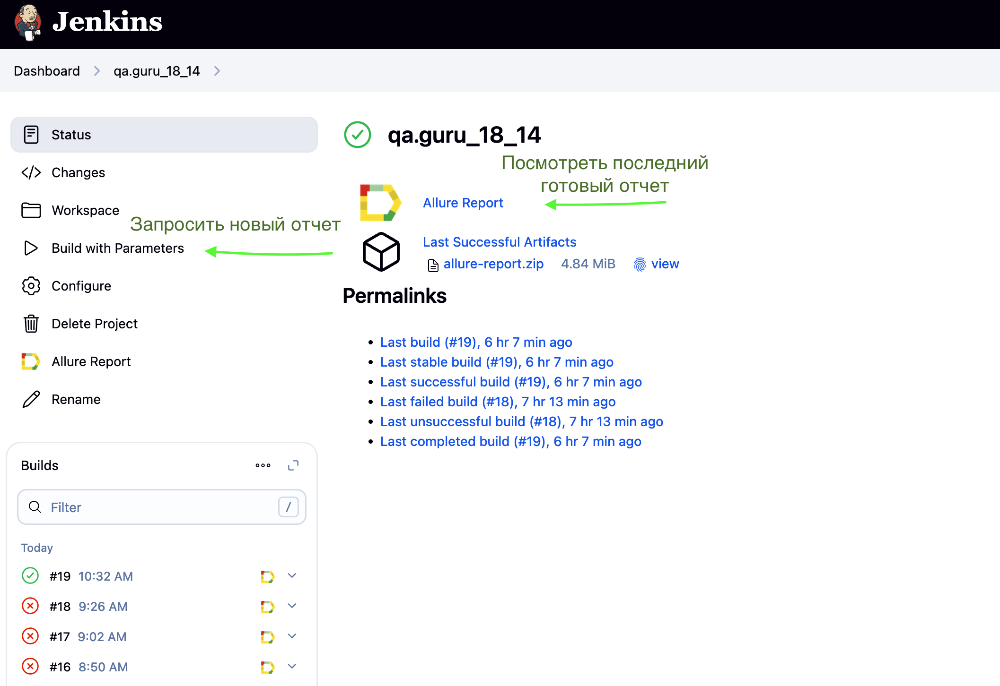

</details>

----

## Локальный запуск автотестов - если Jenkins не работает:

### Для запуска web/UI автотестов скачать репозиторий и выполнить в терминале:

```bash
python -m venv .venv
source .venv/bin/activate
pip install -r requirements.txt
pytest tests/web/.
```

### Получение отчёта после завершения теста:
```bash
allure serve tests/web/allure-results
```


### Для локального запуска mobile автотестов выполнить процедуру:

- [x] Установить appium - brew install appium
- [x] Подсоединить телефон или подключить эмулятор телефона
- [x] Проверить через команду adb devices (для Андроида), что система видит наш девайс
- [x] Запустить Аппиум сервер - в терминале команда "appium"

### Далее выполнить:

```bash
python -m venv .venv
source .venv/bin/activate
pip install -r requirements.txt
pytest tests/android/.
```

### Получение отчёта:
```bash
allure serve tests/android/allure-results

```

----


## Allure: пример отчета
<details>
   <summary>Скриншоты</summary>

###### Главный экран (Overview)
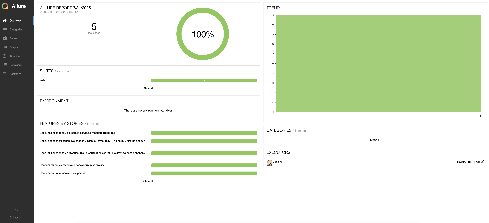
###### Страница со списком тестов (Graph)
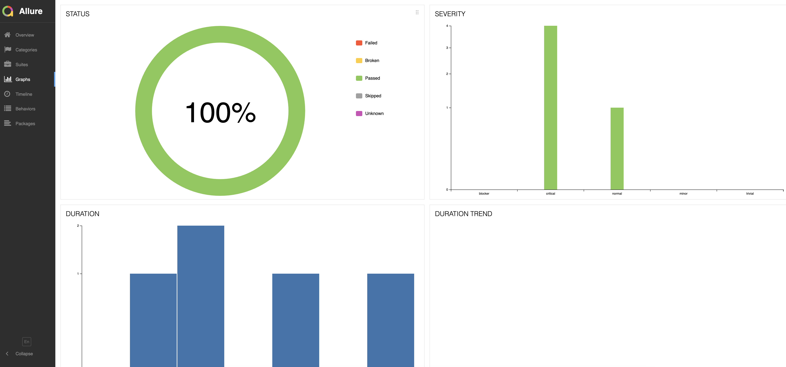
###### Пример описания теста
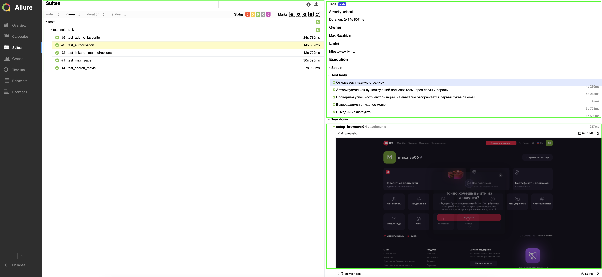

</details>

## Видео тестов
Видеозапись каждого web-теста генерируется с помощью `Selenoid`, после успешного запуска контейнера c тестами в `Docker`.

----


### Gif прохождения mobile автотестов на Android
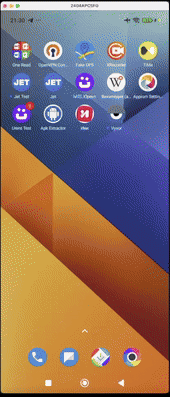

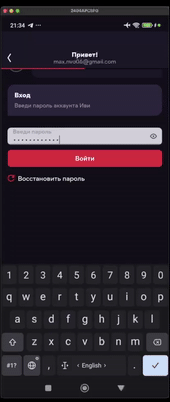

### Gif прохождения mobile автотестов на iOS

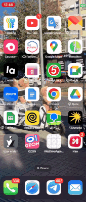
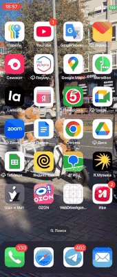


## Отчет в Telegram (падает в случае прохождения через CI/CD Jenkins)
После завершения сборки специальный Telegram-бот отправляет сообщение с отчетом.
Чтобы видеть его увидеть, вступите (временно) в канал `https://t.me/allure_reports_max`


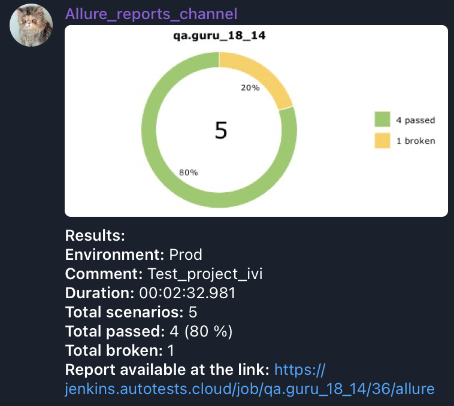

## Полная статистика хранится в Allure TestOps

> [Ссылка на проект в AllureTestOps](https://allure.autotests.cloud/project/4695/dashboards)

#### Дашборд с общими показателями тестовых прогонов


#### История запуска тестовых наборов


#### Тест кейсы

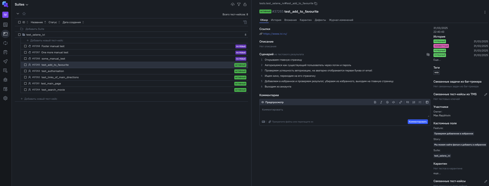

#### Тестовые артефакты

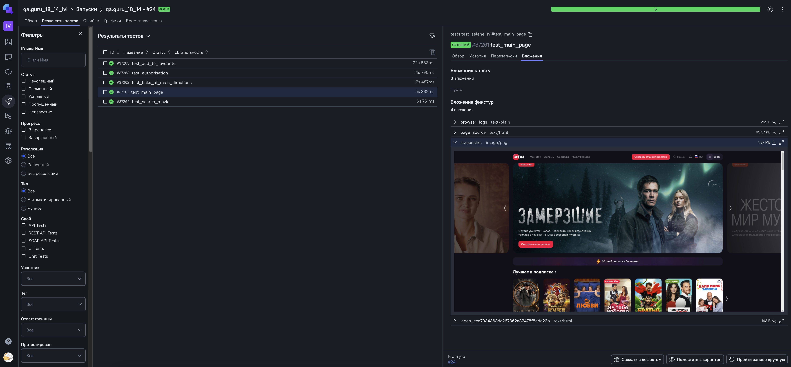

----

### Интеграция с Jira

> [Ссылка на проект в Jira](https://jira.autotests.cloud/browse/HOMEWORK-1430)


